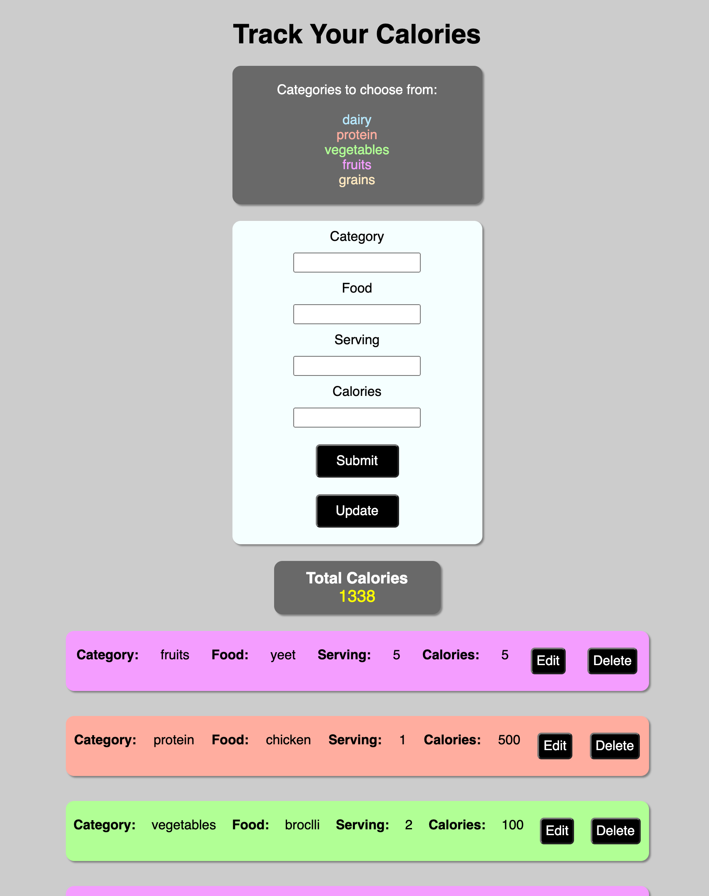

# Calorie Tracker

This idea was inspired by fitness and my own daily routine of keeping track of calories. I wanted to create something that I can easly use on my phones with simple add, edit or delete options while having some math caulate my calories.



## Resource

**Intake**

Attributes:

* category (string)
* food (string)
* serving (integer)
* calories (integer)


## Schema

```mongodb
Intake ({
category: STRING,
food: STRING,
serving: NUMBER,
calories: NUMBER});
```

## REST Endpoints

Name                           | Method | Path
-------------------------------|--------|------------------
Retrieve intake collection     | GET    | /intakes
Retrieve intake member         | GET    | /intakes/*\<id\>*
Create intake member           | POST   | /intakes
Update intake member           | PUT    | /intakes/*\<id\>*
Delete intake member           | DELETE | /intakes/*\<id\>*

## Heroku Link

https://cryptic-beach-90817.herokuapp.com